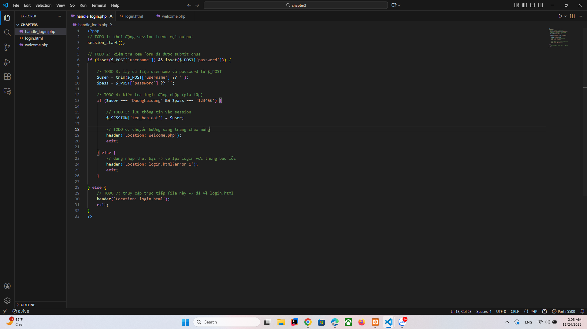
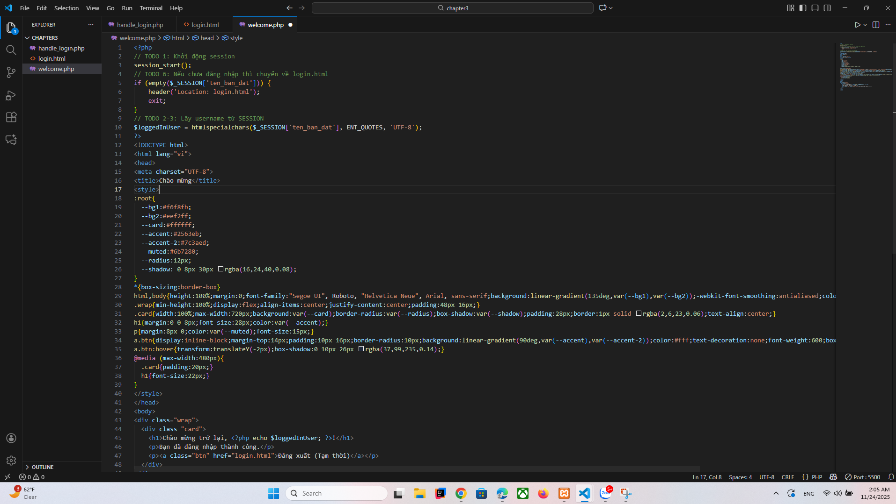

A;code hoàn thiện:
a: hendle_login.php

B:welcome.php

B:Màn hình kết quả trình duyệt web

CÂU HỎI PHẢN BIỆN
Logic hiện tại dùng POST để gửi dữ liệu; nếu ai đó truy cập handle_login.php trực tiếp bằng URL (GET request), code sẽ xử lý ra sao?
