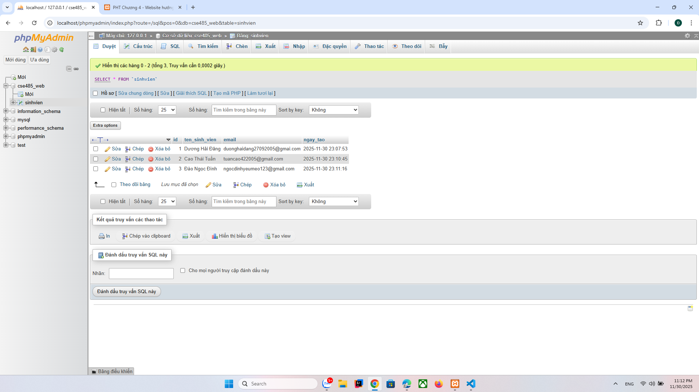
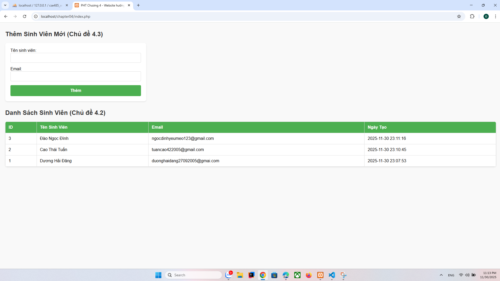

A:code hoàn thiện:
////////////////////
<?php
// === THIẾT LẬP KẾT NỐI PDO === 
$host = '127.0.0.1'; // hoặc localhost 
$dbname = 'cse485_web'; // Tên CSDL bạn vừa tạo 
$username = 'root'; // Username mặc định của XAMPP 
$password = ''; // Password mặc định của XAMPP (rỗng) 
$dsn = "mysql:host=$host;dbname=$dbname;charset=utf8mb4"; 
 
try { 
    // TODO 1: Tạo đối tượng PDO để kết nối CSDL
    $pdo = new PDO($dsn, $username, $password); 
    $pdo->setAttribute(PDO::ATTR_ERRMODE, PDO::ERRMODE_EXCEPTION); 
    // echo "Kết nối thành công!"; // (Bỏ comment để test) 
} catch (PDOException $e) { 
    die("Kết nối thất bại: " . $e->getMessage()); 
} 
 
// === LOGIC THÊM SINH VIÊN (XỬ LÝ FORM POST) === 
// TODO 2: Kiểm tra xem form đã được gửi đi (method POST) và có 'ten_sinh_vien' không
if (isset($_POST['ten_sinh_vien'])) { 
     
    // TODO 3: Lấy dữ liệu 'ten_sinh_vien' và 'email' từ $_POST 
    $ten = $_POST['ten_sinh_vien']; 
    $email = $_POST['email']; 
 
    // TODO 4: Viết câu lệnh SQL INSERT với Prepared Statement (dùng dấu ?) 
    $sql = "INSERT INTO sinhvien (ten_sinh_vien, email) VALUES (?, ?)"; 
     
    // TODO 5: Chuẩn bị (prepare) và thực thi (execute) câu lệnh 
    $stmt = $pdo->prepare($sql); 
    $stmt->execute([$ten, $email]); 
 
    // TODO 6: (Tùy chọn) Chuyển hướng về chính trang này để "làm mới" 
    header('Location: index.php'); 
    exit; 
} 
 
// === LOGIC LẤY DANH SÁCH SINH VIÊN (SELECT) === 
// TODO 7: Viết câu lệnh SQL SELECT * 
$sql_select = "SELECT * FROM sinhvien ORDER BY ngay_tao DESC"; 
 
// TODO 8: Thực thi câu lệnh SELECT (không cần prepare vì không có tham số) 
$stmt_select = $pdo->query($sql_select); 
 
?> 
<!DOCTYPE html> 
<html lang="vi"> 
<head> 
    <meta charset="UTF-8"> 
    <title>PHT Chương 4 - Website hướng dữ liệu</title> 
     
</head> 
<body> 
    <h2>Thêm Sinh Viên Mới (Chủ đề 4.3)</h2> 
    <form action="index.php" method="POST"> 
        Tên sinh viên: <input type="text" name="ten_sinh_vien" required> 
        Email: <input type="email" name="email" required> 
        <button type="submit">Thêm</button> 
    </form> 
 
    <h2>Danh Sách Sinh Viên (Chủ đề 4.2)</h2> 
    <table> 
        <tr> 
            <th>ID</th> 
            <th>Tên Sinh Viên</th> 
            <th>Email</th> 
            <th>Ngày Tạo</th> 
        </tr> 
        <?php 
        // TODO 9: Dùng vòng lặp để duyệt qua kết quả
        while ($row = $stmt_select->fetch(PDO::FETCH_ASSOC)) { 
            // TODO 10: In các dòng <tr> và <td> chứa dữ liệu $row
            echo "<tr>"; 
            echo "<td>" . htmlspecialchars($row['id']) . "</td>"; 
            echo "<td>" . htmlspecialchars($row['ten_sinh_vien']) . "</td>"; 
            echo "<td>" . htmlspecialchars($row['email']) . "</td>"; 
            echo "<td>" . htmlspecialchars($row['ngay_tao']) . "</td>"; 
            echo "</tr>"; 
        } 
        ?> 
    </table> 
</body> 
</html>

B: Ảnh chụp màn hình kết quả:
/////////////////////////////
1:màn hình tab "Browse" (Duyệt) của bảng sinhvien

/////////////////////////////
2: ảnh màn hình trang chapter4.php của bạn, hiển thị đúng 2-3 sinh viên mà bạn vừa thêm (chứng minh SELECT thành công).

////////////////////////////
3:Câu hỏi Phản biện (Bắt buộc) 
-Tại sao phải redirect sau khi submit form?
Nếu không redirect mà để tải lại trang luôn thì có thể gặp lỗi gì?
/////////
-$sql = "INSERT INTO sinhvien (ten_sinh_vien, email): có thể gây ra lỗ hổng bảo mật, và prepared statement lại ngăn được tấn công này?
