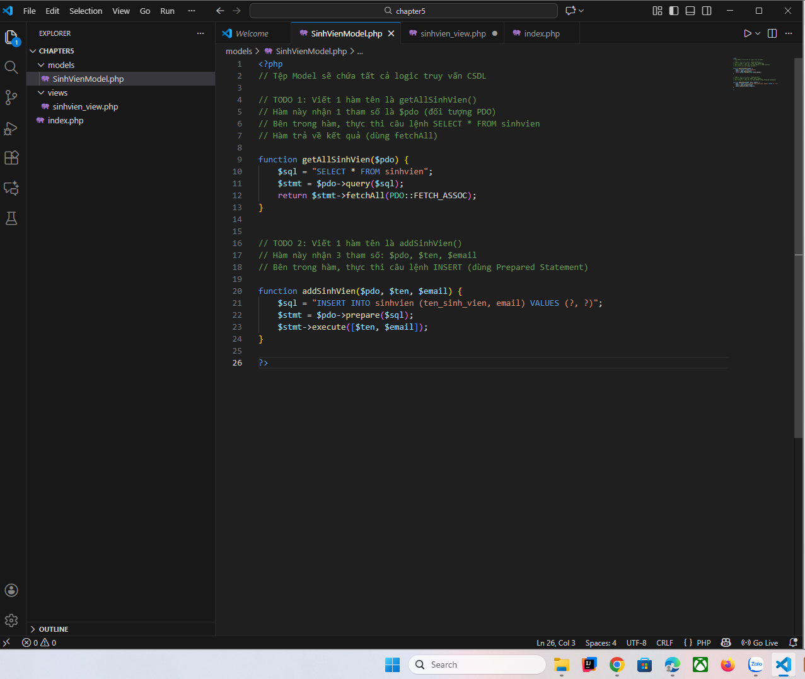
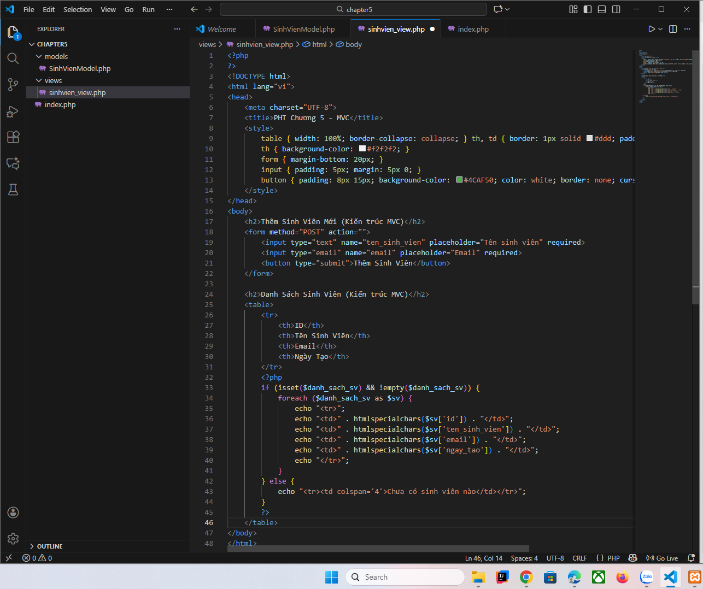
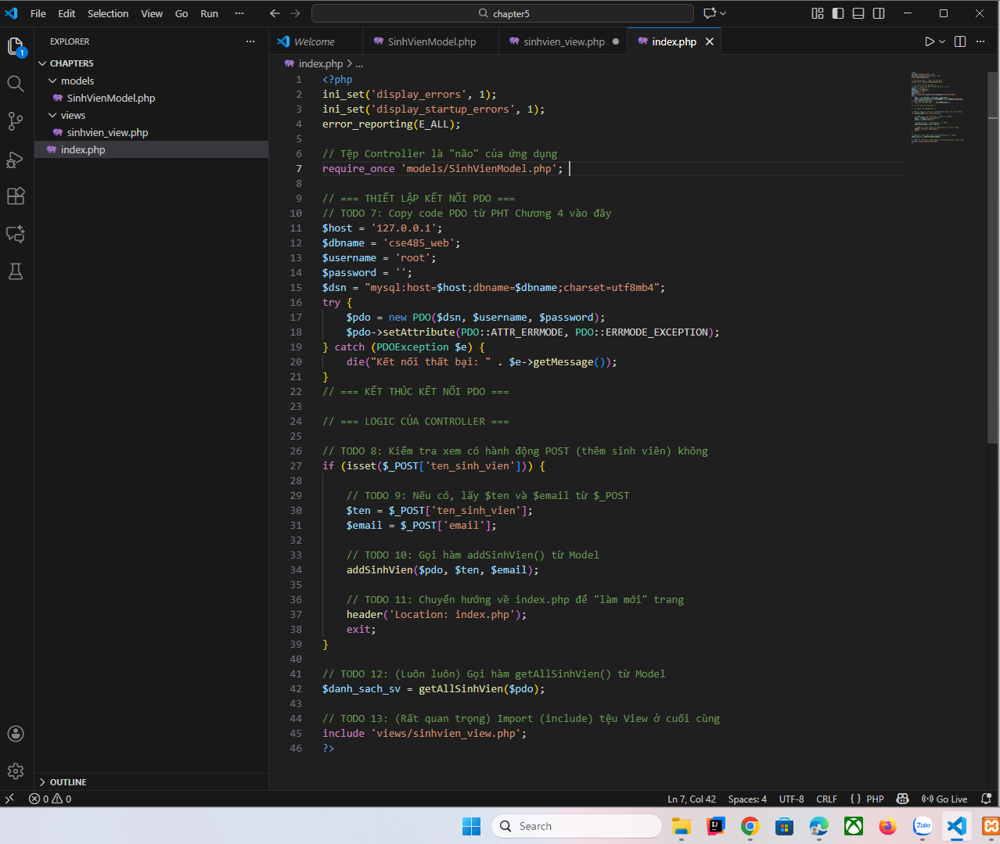
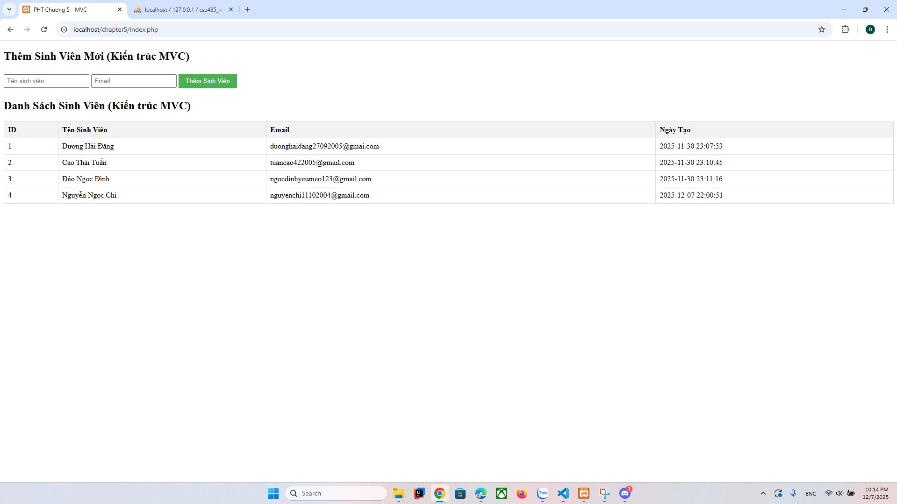

A:Code hoàn thiện:
1:SinhVienModel.php

2:sinhvien_view.php

3:index.php

B: chụp màn hình kết quả:

C: Câu hỏi phản biện:
-Biến $danh_sach_sv được truyền như thế nào?
Controller không truyền tham số vào View, nhưng View vẫn "thấy" được biến này. Cơ chế này hoạt động thế nào?
Có cách truyền dữ liệu tốt hơn không?